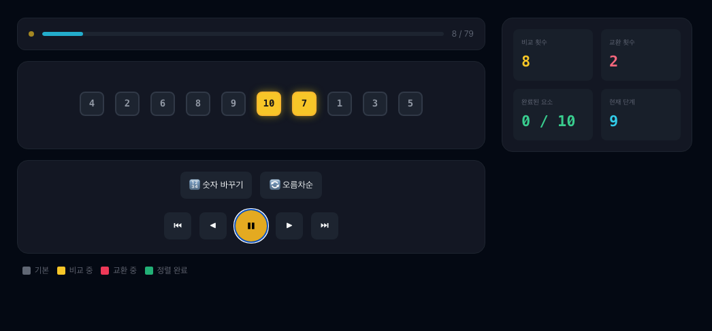
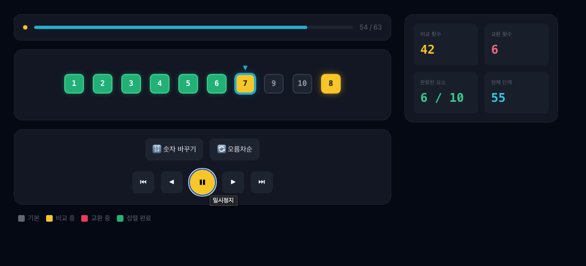

# AlgoCanvas — 알고리즘 시각화 학습 플랫폼

> 추상적인 알고리즘을 **단계별 인터랙티브 애니메이션**으로 시각화한 학습 플랫폼입니다.  
> 외부 차트 라이브러리 없이 순수 CSS + SVG로 직접 구현했으며, 이전/다음/자동재생을 통해 알고리즘의 매 단계를 눈으로 확인할 수 있습니다.

🔗 **배포 링크**: https://algocans.netlify.app/

---

## 구현 화면

### 메인 페이지


### Bubble Sort



### Selection Sort



### 가이드 모달


---

## 기술 스택 및 선택 이유

| 구분       | 기술                    | 선택 이유                                                                  |
| ---------- | ----------------------- | -------------------------------------------------------------------------- |
| 프레임워크 | Next.js 16 (App Router) | 파일 기반 라우팅으로 알고리즘별 페이지 구조를 직관적으로 관리              |
| 언어       | TypeScript              | `Step`, `BarState` 등 알고리즘 상태 타입을 명확히 정의해 버그 사전 차단    |
| 상태 관리  | Zustand                 | Redux 대비 보일러플레이트가 거의 없고, 알고리즘별 독립 스토어 분리가 간단  |
| 스타일링   | CSS Modules             | 컴포넌트 간 클래스명 충돌 없이 각 알고리즘 페이지의 스타일을 안전하게 격리 |
| 런타임     | React 19                | —                                                                          |

### Zustand를 선택한 이유

알고리즘 시각화 특성상 `steps` 배열·`currentStep`·`isPlaying` 등 단순한 전역 상태만 필요했습니다. Redux를 사용하면 action/reducer/selector를 모두 작성해야 하지만, Zustand는 스토어 하나에 상태와 액션을 함께 정의할 수 있어 알고리즘별 스토어(`bubbleSortStore`, `selectionSortStore`)를 빠르게 독립적으로 만들 수 있었습니다. Context API도 고려했으나, 재생 타이머 내부에서 최신 상태를 동기적으로 읽어야 하는 `get()` 패턴이 필요해 Zustand를 선택했습니다.

---

## 기술적 도전과 문제 해결

### 1. "이전 단계로 돌아가기" 구현 — 불변 스냅샷 설계

**문제**: 알고리즘은 배열을 직접 변경하기 때문에, 중간 상태로 되돌아가려면 과거 상태를 저장해 두어야 했습니다.

**해결**: 알고리즘을 실행하기 전에 `buildSteps()`로 모든 단계를 배열에 미리 계산합니다. 각 단계는 `{ bars, comparingIndices, swapped, sortedCount }` 형태의 불변 스냅샷으로 저장됩니다. 재생·일시정지·이전 이동 모두 `currentStep` 인덱스만 조작하면 해결되므로, UI는 `steps[currentStep]`을 읽기만 합니다.

```ts
// store/bubbleSortStore.ts
function buildSteps(arr: number[], descending = false): Step[] {
  const steps: Step[] = [];
  const a = [...arr];
  // ...알고리즘 실행하며 각 단계를 steps에 push
  return steps;
}

// 재생: 타이머로 인덱스만 증가
play() {
  const tick = () => {
    const { currentStep, steps } = get();
    if (currentStep >= steps.length - 1) { set({ isPlaying: false }); return; }
    set((s) => ({ currentStep: s.currentStep + 1 }));
    playTimer = setTimeout(tick, speed);
  };
  tick();
},
// 이전 단계: 인덱스만 감소
prev() { set((s) => ({ currentStep: Math.max(0, s.currentStep - 1) })); },
```

---

### 2. 화살표 등장 시 레이아웃 흔들림 — `position: absolute` 분리

**문제**: Selection Sort에서 목표 위치(`▼`)를 표시할 때, 화살표가 나타나고 사라질 때마다 숫자 블록 전체가 아래로 밀렸습니다.

**해결**: `.barCol`에 `position: relative`를 주고, 화살표를 `position: absolute; top: -18px`으로 띄워 레이아웃 흐름에서 완전히 분리했습니다. `.bars`에 `padding-top: 20px`을 추가해 화살표 공간을 미리 확보하여 다른 블록이 전혀 움직이지 않도록 했습니다.

```css
/* sort.module.css */
.bars {
  padding-top: 20px;
}
.barCol {
  position: relative;
}
.targetArrow {
  position: absolute;
  top: -18px;
  left: 50%;
  transform: translateX(-50%);
}
```

---

### 3. TypeScript 공통 타입 설계 — `BarState` 유니온 타입

**문제**: 막대 색상 상태(`default`, `comparing`, `swapping`, `sorted`)에 임의의 문자열이 들어오면 CSS 클래스 매핑이 깨집니다.

**해결**: 가능한 상태를 유니온 타입 `BarState`로 고정했습니다. `stateClass` 맵의 키 타입이 `Record<BarState, string>`으로 강제되어, 존재하지 않는 상태를 넣으면 컴파일 타임에 즉시 오류가 발생합니다.

```ts
// store/bubbleSortStore.ts
export type BarState = "default" | "comparing" | "swapping" | "sorted";

export interface Bar {
  value: number;
  state: BarState; // 문자열 아닌 유니온 타입으로 제한
}

// components/sort/SortBarChart.tsx
const stateClass: Record<BarState, string> = {
  default: s.default,
  comparing: s.comparing,
  swapping: s.swapping,
  sorted: s.sorted,
};
// BarState에 없는 값을 넣으면 컴파일 에러 발생
```

---

## 아키텍처 및 데이터 흐름

### 디렉토리 구조

```
src/
├── app/
│   ├── page.tsx                   # 메인 홈 (알고리즘 목록 카드)
│   ├── sort-page.module.css       # 정렬 페이지 공통 레이아웃 (두 페이지가 공유)
│   ├── bubble-sort/page.tsx       # Bubble Sort 페이지
│   ├── selection-sort/page.tsx    # Selection Sort 페이지
│   └── dfs/page.tsx               # DFS 페이지
├── components/
│   ├── CtrlBtn.tsx                # 범용 컨트롤 버튼
│   └── sort/
│       ├── SortBarChart.tsx       # 핵심 시각화: 숫자 막대 렌더링
│       ├── SortControls.tsx       # 재생·이전·다음·정렬방향 버튼
│       ├── SortStatsPanel.tsx     # 비교/교환 횟수 통계
│       ├── SortProgressBanner.tsx # 진행도 프로그레스바
│       ├── SortLegend.tsx         # 색상 범례
│       └── GuideModal.tsx         # 사용 가이드 모달
└── store/
    ├── bubbleSortStore.ts         # Bubble Sort 상태 (steps, currentStep, play 등)
    └── selectionSortStore.ts      # Selection Sort 상태 (+ targetIndex)
```

### 데이터 흐름

```
사용자 입력 (버튼 클릭)
        │
        ▼
  Zustand Store
  ┌─────────────────────────────┐
  │ buildSteps() 호출           │  ← init() 시 1회 실행, 전체 단계 사전 계산
  │ steps: Step[]               │
  │ currentStep: number         │  ← play/next/prev로 인덱스만 변경
  │ isPlaying: boolean          │
  └─────────────────────────────┘
        │
        │  steps[currentStep] 구독
        ▼
  Page Component
  (bubble-sort/page.tsx)
        │
        ├── SortBarChart    ← bars[], targetIndex
        ├── SortControls    ← 버튼 이벤트 → store action 호출
        ├── SortStatsPanel  ← comparisons, swaps
        └── SortProgressBanner ← progress, currentStep
```

---

## 주요 기능

- **단계별 탐색** : 이전/다음 버튼으로 알고리즘의 매 단계를 직접 넘겨볼 수 있습니다.
- **자동 재생** : 재생 버튼을 누르면 타이머 기반으로 단계가 자동으로 진행됩니다.
- **오름차순 / 내림차순 전환** : 버튼 하나로 정렬 방향을 실시간으로 바꿉니다.
- **숫자 랜덤 생성** : 새로운 랜덤 배열로 언제든지 다시 시작할 수 있습니다.
- **통계 패널** : 현재까지의 비교 횟수·교환 횟수·정렬 완료 개수를 실시간으로 표시합니다.
- **목표 위치 표시기 (Selection Sort 전용)** : 현재 패스에서 최솟값이 놓일 자리를 `▼` 화살표로 표시합니다.
- **가이드 모달** : 알고리즘 개념·동작 순서·색상 의미·버튼 설명이 담긴 도움말 모달을 제공합니다.

---

## 계획

- [✅] Bubble Sort
- [✅] Selection Sort
- [✅] Insertion Sort
- [✅] Binary Search
- [ ] DFS
- [ ] BFS
- [ ] Merge Sort
- [ ] Quick Sort
- [ ] Union Find
- [ ] Dijkstra
