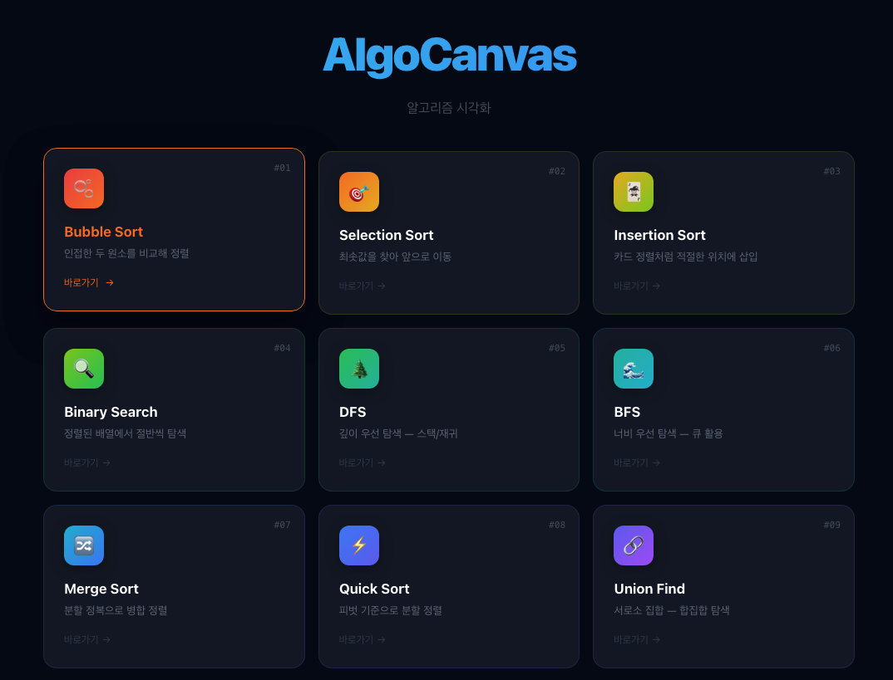
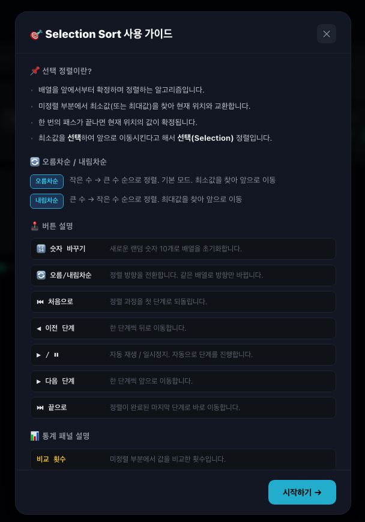
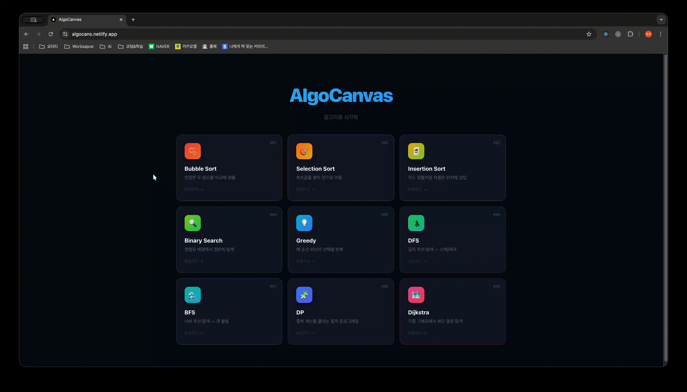
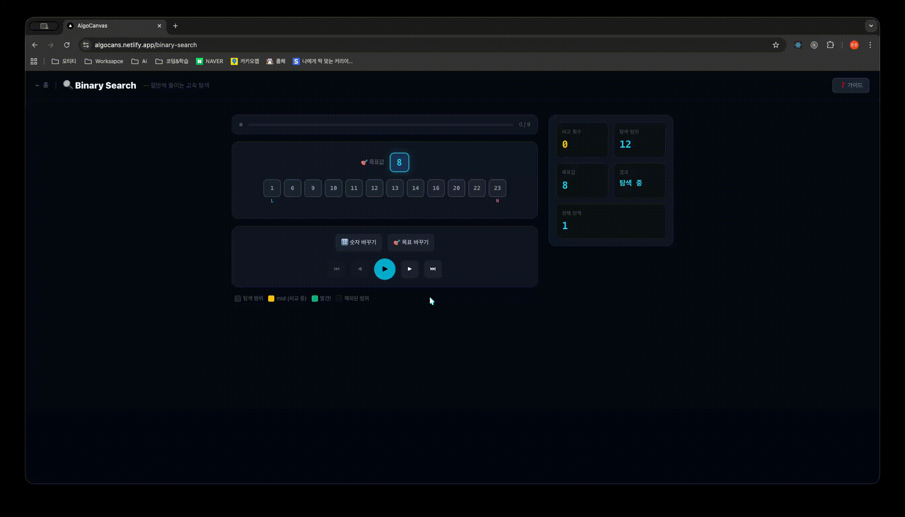
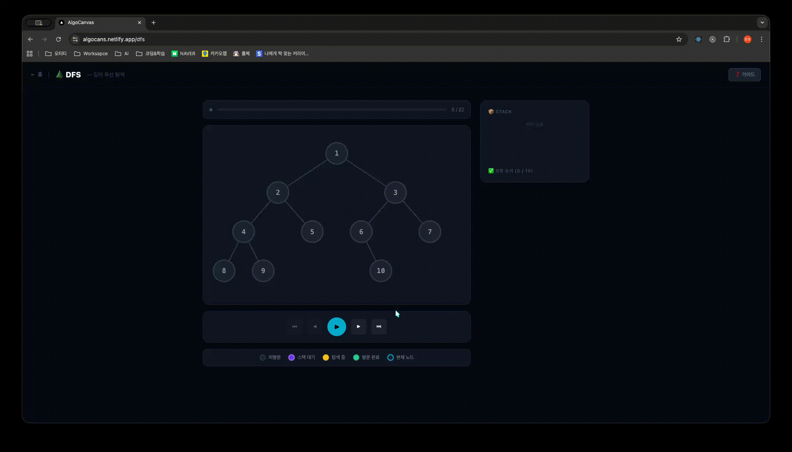
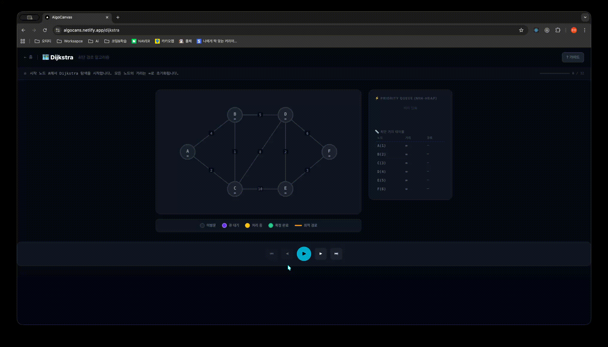
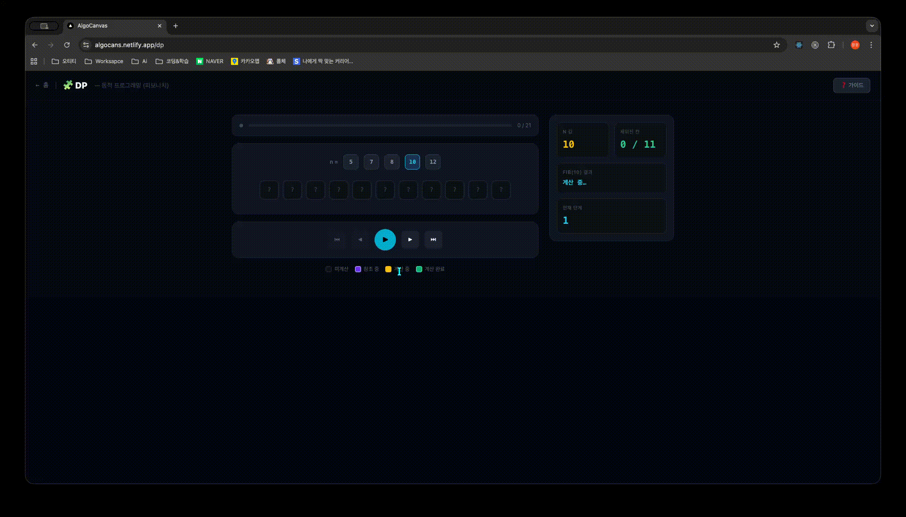
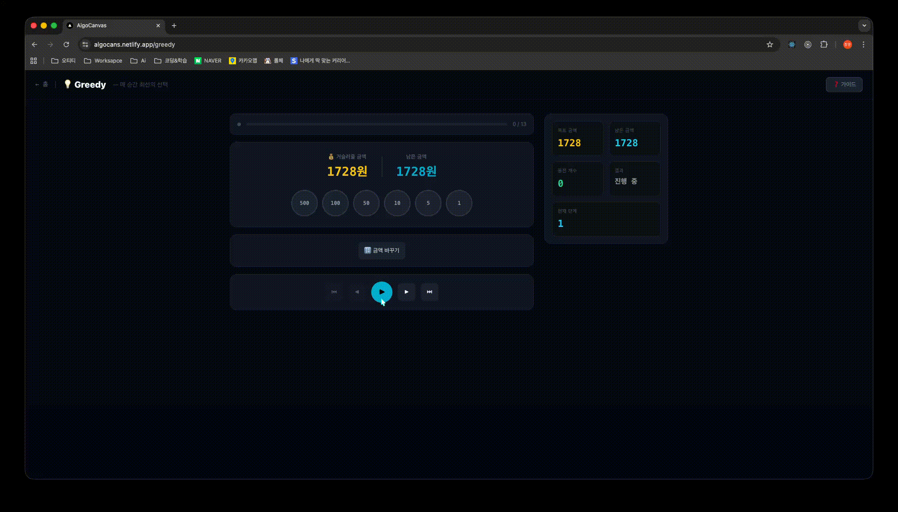

# AlgoCanvas — 알고리즘 시각화 학습 플랫폼

> 추상적인 알고리즘을 **단계별 인터랙티브 애니메이션**으로 시각화한 학습 플랫폼입니다.  
> 외부 차트 라이브러리 없이 순수 CSS + SVG로 직접 구현했으며, 이전/다음/자동재생을 통해 알고리즘의 매 단계를 눈으로 확인할 수 있습니다.  
> 회원가입 · 로그인 후 알고리즘을 즐겨찾기하고 메모를 남길 수 있습니다.

🔗 **배포 링크**: https://algocans.netlify.app/

---

## 시작 방법

```bash
# 의존성 설치
npm install

# 환경 변수 설정 (.env 파일 생성 후 아래 값 입력)
# DATABASE_URL="postgresql://유저:비번@localhost:5432/algocanvas"
# JWT_SECRET="안전한_랜덤_문자열"

# DB 초기화 (최초 1회)
npm run db:migrate

# 개발 서버 실행
npm run dev   # Next.js 앱 (http://localhost:3001)

# 테스트 실행
npm test
```

---

## 구현 화면

### 메인 페이지



### 가이드 모달



### Bubble Sort



### Binary Search



### DFS



### Dijkstra



### DP (피보나치)



### Greedy (거스름돈)



---

## 기술 스택 및 선택 이유

| 구분       | 기술                    | 선택 이유                                                                  |
| ---------- | ----------------------- | -------------------------------------------------------------------------- |
| 프레임워크 | Next.js 16 (App Router) | 파일 기반 라우팅으로 알고리즘별 페이지 구조를 직관적으로 관리              |
| 언어       | TypeScript              | `Step`, `BarState` 등 알고리즘 상태 타입을 명확히 정의해 버그 사전 차단    |
| 상태 관리  | Zustand                 | Redux 대비 보일러플레이트가 거의 없고, 알고리즘별 독립 스토어 분리가 간단  |
| 스타일링   | CSS Modules             | 컴포넌트 간 클래스명 충돌 없이 각 알고리즘 페이지의 스타일을 안전하게 격리 |
| DB / ORM   | PostgreSQL + Prisma     | 타입 안전한 쿼리와 마이그레이션 관리, Netlify 환경과의 호환성              |
| 인증       | JWT + bcryptjs          | Stateless 토큰 인증으로 별도 세션 서버 없이 API Routes에서 간단하게 검증   |
| 런타임     | React 19                | —                                                                          |

### Zustand를 선택한 이유

알고리즘 시각화 특성상 `steps` 배열·`currentStep`·`isPlaying` 등 단순한 전역 상태만 필요했습니다. Redux를 사용하면 action/reducer/selector를 모두 작성해야 하지만, Zustand는 스토어 하나에 상태와 액션을 함께 정의할 수 있어 알고리즘별 스토어(`bubbleSortStore`, `selectionSortStore`)를 빠르게 독립적으로 만들 수 있었습니다. Context API도 고려했으나, 재생 타이머 내부에서 최신 상태를 동기적으로 읽어야 하는 `get()` 패턴이 필요해 Zustand를 선택했습니다.

---

## 기술적 도전과 문제 해결

### 1. "이전 단계로 돌아가기" 구현 — 불변 스냅샷 설계

**문제**: 알고리즘은 배열을 직접 변경하기 때문에, 중간 상태로 되돌아가려면 과거 상태를 저장해 두어야 했습니다.

**해결**: 알고리즘을 실행하기 전에 `buildSteps()`로 모든 단계를 배열에 미리 계산합니다. 각 단계는 `{ bars, comparingIndices, swapped, sortedCount }` 형태의 불변 스냅샷으로 저장됩니다. 재생·일시정지·이전 이동 모두 `currentStep` 인덱스만 조작하면 해결되므로, UI는 `steps[currentStep]`을 읽기만 합니다.

```ts
// store/bubbleSortStore.ts
function buildSteps(arr: number[], descending = false): Step[] {
  const steps: Step[] = [];
  const a = [...arr];
  // ...알고리즘 실행하며 각 단계를 steps에 push
  return steps;
}

// 재생: 타이머로 인덱스만 증가
play() {
  const tick = () => {
    const { currentStep, steps } = get();
    if (currentStep >= steps.length - 1) { set({ isPlaying: false }); return; }
    set((s) => ({ currentStep: s.currentStep + 1 }));
    playTimer = setTimeout(tick, speed);
  };
  tick();
},
// 이전 단계: 인덱스만 감소
prev() { set((s) => ({ currentStep: Math.max(0, s.currentStep - 1) })); },
```

---

### 2. 화살표 등장 시 레이아웃 흔들림 — `position: absolute` 분리

**문제**: Selection Sort에서 목표 위치(`▼`)를 표시할 때, 화살표가 나타나고 사라질 때마다 숫자 블록 전체가 아래로 밀렸습니다.

**해결**: `.barCol`에 `position: relative`를 주고, 화살표를 `position: absolute; top: -18px`으로 띄워 레이아웃 흐름에서 완전히 분리했습니다. `.bars`에 `padding-top: 20px`을 추가해 화살표 공간을 미리 확보하여 다른 블록이 전혀 움직이지 않도록 했습니다.

```css
/* sort.module.css */
.bars {
  padding-top: 20px;
}
.barCol {
  position: relative;
}
.targetArrow {
  position: absolute;
  top: -18px;
  left: 50%;
  transform: translateX(-50%);
}
```

---

### 3. TypeScript 공통 타입 설계 — `BarState` 유니온 타입

**문제**: 막대 색상 상태(`default`, `comparing`, `swapping`, `sorted`)에 임의의 문자열이 들어오면 CSS 클래스 매핑이 깨집니다.

**해결**: 가능한 상태를 유니온 타입 `BarState`로 고정했습니다. `stateClass` 맵의 키 타입이 `Record<BarState, string>`으로 강제되어, 존재하지 않는 상태를 넣으면 컴파일 타임에 즉시 오류가 발생합니다.

```ts
// store/bubbleSortStore.ts
export type BarState = "default" | "comparing" | "swapping" | "sorted";

export interface Bar {
  value: number;
  state: BarState; // 문자열 아닌 유니온 타입으로 제한
}

// components/sort/SortBarChart.tsx
const stateClass: Record<BarState, string> = {
  default: s.default,
  comparing: s.comparing,
  swapping: s.swapping,
  sorted: s.sorted,
};
// BarState에 없는 값을 넣으면 컴파일 에러 발생
```

---

### 4. 로그아웃 시 잔류 데이터 — 즉시 초기화

**문제**: 로그아웃 후에도 이전 사용자의 즐겨찾기·메모가 화면에 남아 있었습니다.

**해결**: `useAuthStore`의 `logout()`과 `useUserDataStore`의 `clear()`를 함께 호출해 로그아웃 즉시 두 스토어를 동시에 초기화합니다.

```ts
// components/AuthNav.tsx
const handleLogout = () => {
  logout(); // authStore: token, user → null
  clear(); // userDataStore: bookmarks[], memos{} → 초기값
  router.refresh();
};
```

---

### 5. SSR Hydration 안전한 클라이언트 전용 UI — `useSyncExternalStore`

**문제**: 비로그인 안내 모달을 마운트 후 자동으로 열기 위해 `useEffect` 내부에서 `setState`를 호출했더니, React 컴파일러가 "렌더 캐스케이드 유발" 오류를 발생시켰습니다.

**해결**: `useSyncExternalStore`의 서버/클라이언트 snapshot을 분리해 Hydration mismatch 없이 CSR 전용 UI를 렌더링했습니다.

```ts
// components/AuthInfoModal.tsx
const subscribe = () => () => {};

const mounted = useSyncExternalStore(
  subscribe, // 외부 구독 없음
  () => true, // 클라이언트: 마운트됨 → 모달 표시
  () => false, // 서버(SSR): 마운트 안 됨 → 렌더 스킵
);
```

---

## 아키텍처 및 데이터 흐름

### 디렉토리 구조

```
src/
├── app/
│   ├── page.tsx                   # 메인 홈 (알고리즘 목록 카드)
│   ├── layout.tsx                 # 공통 레이아웃 (AuthNav 포함)
│   ├── api/
│   │   ├── auth/register/         # POST /api/auth/register
│   │   ├── auth/login/            # POST /api/auth/login
│   │   ├── bookmarks/             # GET·POST·DELETE /api/bookmarks
│   │   └── memos/                 # GET·PUT·DELETE /api/memos
│   ├── login/page.tsx             # 로그인 페이지
│   ├── register/page.tsx          # 회원가입 페이지
│   ├── bubble-sort/page.tsx       # Bubble Sort 페이지
│   ├── selection-sort/page.tsx    # Selection Sort 페이지
│   ├── insertion-sort/page.tsx    # Insertion Sort 페이지
│   ├── binary-search/page.tsx     # Binary Search 페이지
│   ├── dfs/page.tsx               # DFS 페이지
│   ├── bfs/page.tsx               # BFS 페이지
│   ├── dijkstra/page.tsx          # Dijkstra 페이지
│   ├── dp/page.tsx                # DP (피보나치) 페이지
│   └── greedy/page.tsx            # Greedy (활동 선택) 페이지
├── components/
│   ├── AuthNav.tsx                # 상단 Nav (로그인/로그아웃 상태 반영)
│   ├── AuthInfoModal.tsx          # 비로그인 사용자 안내 모달
│   ├── AlgoGrid.tsx               # 알고리즘 카드 그리드 (북마크·메모 버튼 포함)
│   ├── MemoModal.tsx              # 메모 작성/수정/삭제 모달
│   ├── CtrlBtn.tsx                # 범용 컨트롤 버튼
│   ├── GuideModal.tsx             # 사용 가이드 모달
│   ├── sort/                      # 정렬 알고리즘 공통 컴포넌트
│   │   ├── SortBarChart.tsx       # 핵심 시각화: 숫자 막대 렌더링
│   │   ├── SortControls.tsx       # 재생·이전·다음·정렬방향 버튼
│   │   ├── SortStatsPanel.tsx     # 비교/교환 횟수 통계
│   │   ├── SortProgressBanner.tsx # 진행도 프로그레스바
│   │   └── SortLegend.tsx         # 색상 범례
│   ├── binary-search/             # Binary Search 전용 컴포넌트
│   ├── dfs/                       # DFS 전용 컴포넌트
│   ├── bfs/                       # BFS 전용 컴포넌트
│   ├── dijkstra/                  # Dijkstra 전용 컴포넌트
│   ├── dp/                        # DP 전용 컴포넌트
│   └── greedy/                    # Greedy 전용 컴포넌트
├── lib/
│   ├── api.ts                     # fetch 래퍼 (register·login·bookmark·memo)
│   ├── auth.ts                    # JWT 발급·검증 유틸
│   └── prisma.ts                  # Prisma Client 싱글턴
└── store/
    ├── __tests__/                 # Vitest 단위 테스트 (9개 파일, 123개 테스트)
    ├── authStore.ts               # 로그인 상태 (token, user) — persist
    ├── userDataStore.ts           # 북마크·메모 상태 (서버 동기화)
    ├── bubbleSortStore.ts         # Bubble Sort 상태
    ├── selectionSortStore.ts      # Selection Sort 상태 (+ targetIndex)
    ├── insertionSortStore.ts      # Insertion Sort 상태
    ├── binarySearchStore.ts       # Binary Search 상태
    ├── dfsStore.ts                # DFS 상태 (스택 시각화)
    ├── bfsStore.ts                # BFS 상태 (큐 시각화)
    ├── dijkstraStore.ts           # Dijkstra 상태 (최단 거리 테이블)
    ├── dpStore.ts                 # DP 상태 (피보나치 테이블)
    └── greedyStore.ts             # Greedy 상태 (활동 선택)
```

### 데이터 흐름 — 알고리즘 시각화

```
사용자 입력 (버튼 클릭)
        │
        ▼
  Zustand Store
  ┌─────────────────────────────┐
  │ buildSteps() 호출           │  ← init() 시 1회 실행, 전체 단계 사전 계산
  │ steps: Step[]               │
  │ currentStep: number         │  ← play/next/prev로 인덱스만 변경
  │ isPlaying: boolean          │
  └─────────────────────────────┘
        │
        │  steps[currentStep] 구독
        ▼
  Page Component
  (bubble-sort/page.tsx)
        │
        ├── SortBarChart    ← bars[], targetIndex
        ├── SortControls    ← 버튼 이벤트 → store action 호출
        ├── SortStatsPanel  ← comparisons, swaps
        └── SortProgressBanner ← progress, currentStep
```

### 데이터 흐름 — 인증 및 사용자 데이터

```
로그인 성공
        │  JWT 토큰 발급
        ▼
  authStore (persist)           ← 새로고침 후에도 로그인 유지
  { token, user }
        │
        │  token으로 API 호출
        ▼
  userDataStore.fetchAll()
  { bookmarks: string[], memos: Record<string, string> }
        │
        ├── AlgoGrid  ← 북마크 별(★) 색상 표시
        └── MemoModal ← 메모 내용 표시·저장·삭제

로그아웃
        │
        ├── authStore.logout()      → token, user = null
        └── userDataStore.clear()   → bookmarks = [], memos = {}
```

---

## 주요 기능

- **단계별 탐색** : 이전/다음 버튼으로 알고리즘의 매 단계를 직접 넘겨볼 수 있습니다.
- **자동 재생** : 재생 버튼을 누르면 타이머 기반으로 단계가 자동으로 진행됩니다.
- **오름차순 / 내림차순 전환** : 버튼 하나로 정렬 방향을 실시간으로 바꿉니다.
- **숫자 랜덤 생성** : 새로운 랜덤 배열로 언제든지 다시 시작할 수 있습니다.
- **통계 패널** : 현재까지의 비교 횟수·교환 횟수·정렬 완료 개수를 실시간으로 표시합니다.
- **목표 위치 표시기 (Selection Sort 전용)** : 현재 패스에서 최솟값이 놓일 자리를 `▼` 화살표로 표시합니다.
- **가이드 모달** : 알고리즘 개념·동작 순서·색상 의미·버튼 설명이 담긴 도움말 모달을 제공합니다.
- **회원가입 · 로그인** : Next.js API Routes + Prisma + PostgreSQL 기반. 비밀번호는 bcryptjs로 해시 저장, JWT로 인증합니다.
- **알고리즘 즐겨찾기** : 로그인 후 알고리즘 카드에서 ★ 버튼으로 즐겨찾기를 DB에 저장합니다.
- **메모** : 알고리즘별로 개인 메모를 작성·수정·삭제할 수 있습니다.

---

## 테스트

**Vitest** 기반 단위 테스트로 9개 알고리즘 스토어의 핵심 로직을 검증합니다.

### 테스트 실행

```bash
# 단일 실행
npm test

# 감시(watch) 모드
npm run test:watch

# 커버리지 리포트 생성
npm run test:coverage
```

### 테스트 범위 (9개 파일, 123개 테스트)

| 테스트 파일                  | 주요 검증 항목                                                                 |
| ---------------------------- | ------------------------------------------------------------------------------ |
| `bubbleSortStore.test.ts`    | 스텝 생성, 오름차순/내림차순 정렬 결과, next/prev/reset/ending, reverse 토글   |
| `selectionSortStore.test.ts` | 스텝 생성, 정렬 결과, 비교 스텝 존재 여부, sortedCount                         |
| `insertionSortStore.test.ts` | 스텝 생성, 정렬 결과, comparing/swapping 상태 존재 여부                        |
| `binarySearchStore.test.ts`  | 정렬된 배열 생성, found/notFound 결과, changeTarget 동작                       |
| `dfsStore.test.ts`           | DFS 방문 순서 `[1,2,4,8,9,5,3,6,10,7]`, 모든 노드 visited                      |
| `bfsStore.test.ts`           | BFS 방문 순서 `[1,2,3,4,5,6,7,8,9,10]`, DFS와의 방문 순서 차이                 |
| `dijkstraStore.test.ts`      | 최단 거리 정확성 (1→2: 3, 1→3: 2, 1→4: 8, 1→5: 10, 1→6: 13), 모든 노드 settled |
| `dpStore.test.ts`            | 피보나치 수열 값 정확성 (dp[10]=55), computing/referencing 상태, changeN       |
| `greedyStore.test.ts`        | 거스름돈 최소 동전 수 (890원→9개), 각 동전 사용 횟수, 합계 검증                |

---

## 구현 완료

- [✅] Bubble Sort
- [✅] Selection Sort
- [✅] Insertion Sort
- [✅] Binary Search
- [✅] DFS
- [✅] BFS
- [✅] Dijkstra
- [✅] DP (피보나치)
- [✅] Greedy (거스름돈)
- [✅] 회원가입 · 로그인 (Next.js API Routes + Prisma + JWT)
- [✅] 알고리즘 즐겨찾기
- [✅] 알고리즘 메모

---

## 향후 개발 계획

- [ ] 커스텀 입력 저장 — 사용자가 직접 입력한 배열·그래프 데이터를 DB에 저장하고 나중에 불러올 수 있는 기능
- [ ] 학습 진도 기록 — 알고리즘별 실행 횟수·마지막 실행 시각을 DB에 기록해 학습 히스토리를 제공하는 기능
